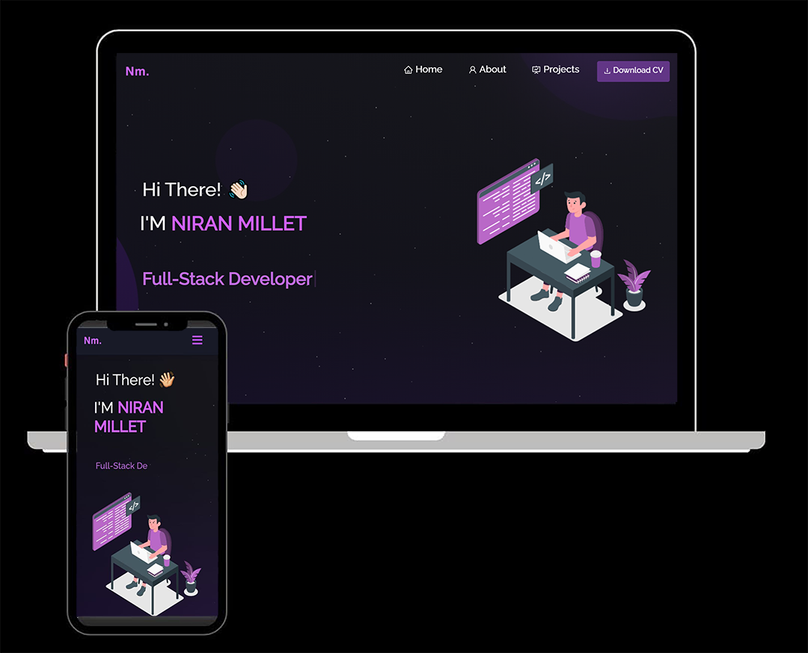

<h2 align="center">
  Portfolio Website - Niran Millet
</h2>

  

 

 &nbsp;
 &nbsp;
 &nbsp;
 &nbsp;

## Built With

This project was built using these technologies.

- React.js
- Node.js
- Express.js
- CSS3
- VsCode
- Vercel

## Features

**📖 Multi-Page Layout**

**🎨 Styled with React-Bootstrap and Css with easy to customize colors**

**📱 Fully Responsive**

## Getting Started

Special Thanks to Soumyajit4419 for making the template and layout
Core Project can be foudn on his profile 
https://github.com/soumyajit4419/Portfolio 

